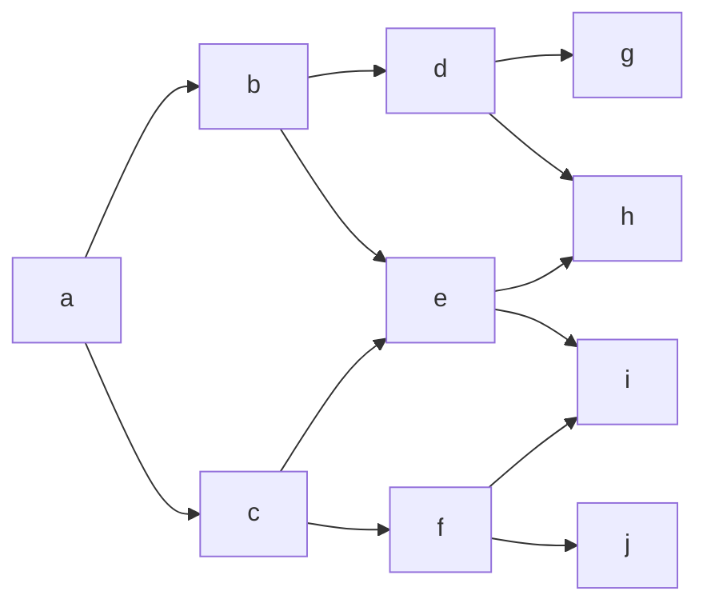
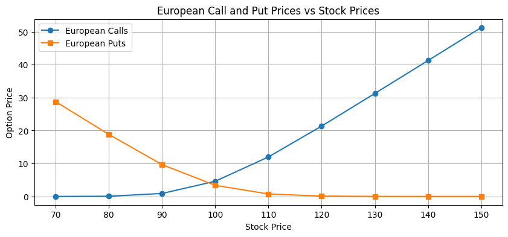
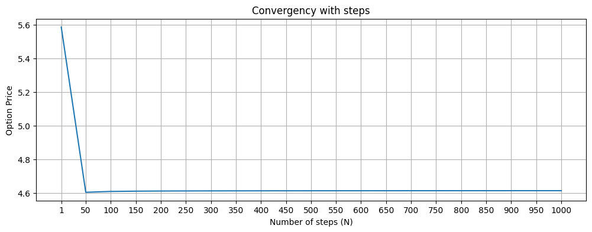
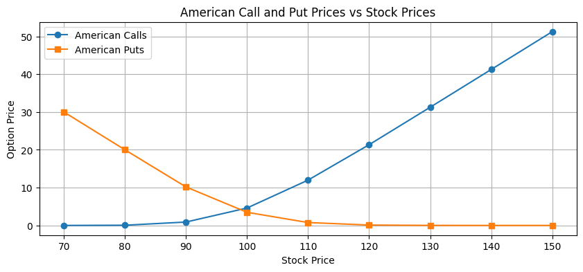
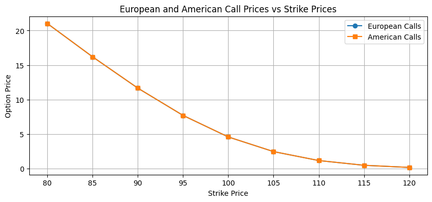
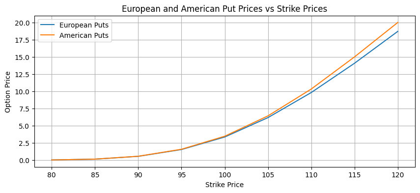
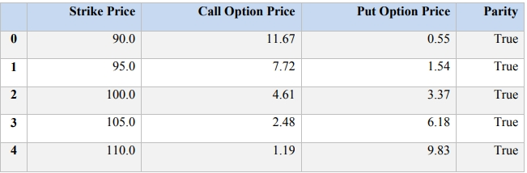
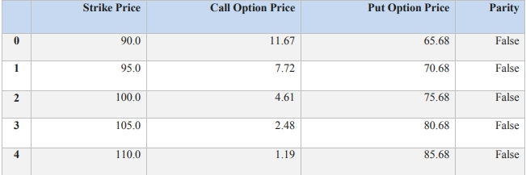
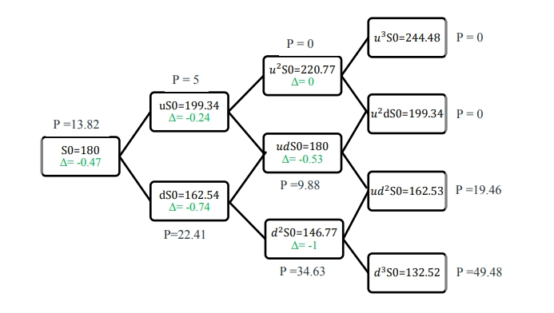
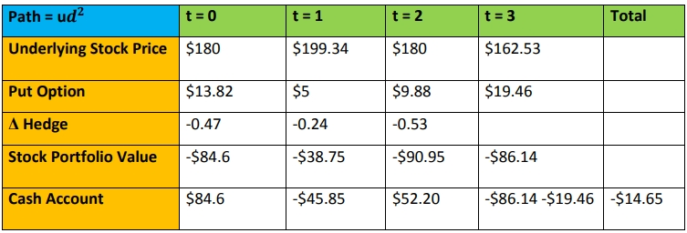

# DP-GWP1-Option-Pricing

## Table - American Option Using Trinomial
|	|Strike Price	|Call Option Price	|Put Option Price	|Parity|
|---|------------   |-----------------  |----------------   |------|
|0	|90.0	        |11.67	            |65.68	            |False |
|1	|95.0	        |7.72	            |70.68	            |False |
|2	|100.0	        |4.61            	|75.68	            |False |
|3	|105.0	        |2.48	            |80.68	            |False |
|4	|110.0	        |1.19	            |85.68	            |False |

## **1. Introduction**

In the first project of derivative pricing, we are analyzing both Put
and call options (American, European and Asian) using several option
pricing models like binomial tree, trinomial tree, Black-Scholes model
etc. Also, we will calculate Greek Delta and measure sensitivity of
options prices to volatility. Finally we will see how delta hedging
works and how to implement it.

## **2. Put-Call Parity in the context of binomial tree model:**

Put-Call parity for options is given by the following equation:

$$C_{0}\  + \ Ke^{- rT} = \ S_{0}\  + \ P_{0}\ \ \ \ \ \ \ \ \ \ \ \ \ \ \ \ \ \ \ \ \ \ \ \ \ \ \cdots(1)$$

Where:

$S_{0}$ = underlying's price at time t = 0

$C_{0}$ = call option's price at time t = 0

$P_{0}$ = put option's price at time t = 0

K = strike price for both options

r = risk free rate

T = time to maturity for both options

### **2.1. Put-Call parity for European options:**

The put-call parity for European options is given by the equation (1)
above. It can be re-written as:

$$C_{0} - P_{0} = \ S_{0} - Ke^{- rT}$$

This equation only holds for European options as they can be exercised
only at the time of maturity allowing us to replicate an equivalent
portfolio (long call and short put) consisting of underlying stock,
priced at spot price and borrowing money equal to strike price
discounted to present. Thus, offering no-arbitrage in the efficient
market [(Stoll)](#Stoll).

### **2.2. Call and Put price according to Put-Call parity:**

The put-call parity equation can be re-written to obtain call and put
option price at the time of inception respectively as,

$$\boxed{C_{0} = S_{0}\  + \ P_{0} - Ke^{- rT}}$$

$$\boxed{P_{0} = \ C_{0} + Ke^{- rT} - S_{0}}$$

### **2.3. Put-Call parity for American options:**

The put-call parity does not work for American options strictly. Why,
contrary to European options, American options can be exercised at any
time before or at maturity. This flexibility brings additional
complexities in options\' pricing. The potential for early exercise
makes the relationship between call and put prices more fluid, leading
to an inequality instead of an exact equality. This is given by the
equation:

$$S_{0} - K \leq C_{0} - P_{0} \leq \ S_{0} - Ke^{- rT}$$

## **3. Parameters used for option pricing in binomial tree:**

$S_{0}$ = 100; r = 5%; σ = 20%; T = 3 months; Moneyness = ATM

### **3.1 Calculate Parameters:**

-   **Time increment** $\mathbf{(\Delta t)}:$

$$\Delta t = T/n = 0.25/100 = 0.0025\ years$$

-   **Up and Down Factors**:

$$u = e^{\sigma\sqrt{}\Delta t} = e^{0.2\sqrt{}0.0025} \approx 1.01\ \ \ \ ;\ \ \ \ d = \frac{1}{u} \approx 0.99$$

-   **Risk-neutral Probability**$\mathbf{(}\mathbf{p}\mathbf{)}$**:**

$$p = \frac{e^{r\Delta t} - d}{u - d} \approx \frac{e^{0.05 \cdot 0.0025} - 0.99}{1.01 - 0.99} \approx 0.51$$

### **3.2 Build the Binomial Tree**

a.  **Price Calculation**:

-   At each node, the price at time $t$ can be calculated as:

$$S_{i,j} = S_{0} \cdot u^{j} \cdot d^{i - j}$$

-   Where $i$ is the step number and $j$ is the number of upward
    movements.

b.  **Calculate Call and Put Payoffs at Maturity**:

-   For a call option:

$$C_{i,j} = max(0,S_{i,j} - K)$$

-   For a put option:

$$P_{i,j} = max(0,K - S_{i,j})$$

c.  **Backward Induction**:

-   Calculate option values at earlier nodes using:

$$C_{i,j} = e^{- r\Delta t}(p \cdot C_{i + 1,j + 1} + (1 - p) \cdot C_{i + 1,j})$$

-   For American options, additionally, check for early exercise:

$C_{i,j} = max(C_{i,j},S_{i,j} - K)$ (for call)

$P_{i,j} = max(P_{i,j},K - S_{i,j})$ (for put)

## **4. Pricing European calls and puts using a binomial tree:**

For pricing European calls and put, we first obtained no. of steps, **N
= 100.** For this, we plotted the option price vs no. of steps graph
(see accompanied python file) as shown below. As one can see, the prices
started converging at N =100.

This number strikes a balance between computational efficiency and
accuracy. Going beyond N=100, does not improve accuracy but increases
computational costs. For all below see accompanied python file.

### **4.1 European Call and Put Prices:**

For N = 100, using Python code, we get:

**European Call Price = 4.61**

**European Put Price = 3.36**

### **4.2 Put-Call Parity:**

For the options' prices obtained above, we can see that put-call parity
equation (1) holds true.

### **4.3 Greek Delta, Δ at time, t = 0:**

The Greek delta is calculated using equation,

$$\mathrm{\Delta}\  = \ \frac{X_{u} - X_{d}}{S_{u} - S_{d}}$$

So, we get

**European Call Delta = 0.57**

**European Put Delta = -0.43**

For at-the-money (ATM) options, Delta is usually around 0.5 for both
call and put. The Delta of call options is positive, reflecting their
nature of gaining value when the underlying asset price rises. In
contrast, the Delta of put options is negative, indicating that they
gain value when the underlying asset price falls. This fundamental
difference arises from the pay-off structures of the options.

Delta measures the sensitivity of an option\'s price to changes in the
underlying asset price. Specifically, it indicates how much the option
price is expected to change with a \$1 change in the underlying asset
price. This makes Delta a crucial metric for traders to assess the
directional risk of their options positions.

A positive Delta for call options makes sense because they provide the
right to buy the underlying asset at a fixed price, benefiting from
price increases. A negative Delta for put options is logical as they
provide the right to sell the underlying asset at a fixed price,
benefiting from price decreases.

### **4.4 Sensitivity of the option price to the underlying volatility(Vega):**

Now, we calculate Vega i.e sensitivity of previous put and call option
prices to a 5% increase in volatility (from 20% to 25%).

The Vega, *ν* is calculated as:

$$\nu\  = \ \frac{C_{0,\sigma_{1}} - C_{0,\sigma_{0}}}{\Delta\sigma}$$

Where,

Δσ = $\sigma_{1} - \sigma_{0}$,

$C_{0,\sigma_{1}}$ = option price at volatility, $\sigma_{1}$

$C_{0,\sigma_{0}}$ = option price at volatility, $\sigma_{0}$

Hence, we get:

**Vega for European call = 19.62**

**Vega for European put = 19.62**

**European Call Price at volatility 20% = 4.61**

**European Call Price at volatility 25% = 5.59**

**European Put Price at volatility 20% = 3.36**

**European Put Price at volatility 25% = 4.34**

The Vega for both European options come out to be 19.62% for increase in
volatility from 20% to 25%. While the prices of both options increases
with increase in volatility. This means, for 1% increase in volatility,
option price will move by 0.1962 units. So, in our case for increase of
5% in volatility, we can see prices increase by 0.98 units.

### **4.5 European Call and Put Prices vs Stock Price Chart:**

We can see that in above graph that for a given strike price (K =100),
ATM in this case, as the stock prices increases, the price of European
call increases as call option becomes deeper in ITM. On the other hand
the price of European put decreases as put option becomes deeper in OTM
as the stock price grows.

## **5. Pricing American calls and puts using a binomial tree:**

For pricing American calls and put, we first obtained no. of steps, **N
= 100.** And we again plotted the option price vs no. of steps graph
(see accompanied python file) as shown below. As one can see, the prices
started converging at N = 100. For all below see accompanied python
file.

### **5.1 American Call and Put Prices:**

For N = 100, using Python code, we get:

**American Call Price = 4.61**

**American Put Price = 3.47**

### **5.2 Put-Call Parity:**

For the options' prices obtained above, we can see that put-call parity
equation (1) does not holds true.

### **5.3 Greek Delta, Δ at time, t = 0:**

The Greek delta is calculated using equation,

$$\mathrm{\Delta}\  = \ \frac{X_{u} - X_{d}}{S_{u} - S_{d}}$$

So, we get

**American Call Delta = 0.57**

**American Put Delta = -0.45**

For at-the-money (ATM) options, Delta is usually around 0.5 for both
call and put. The Delta of call options is positive, reflecting their
nature of gaining value when the underlying asset price rises. In
contrast, the Delta of put options is negative, indicating that they
gain value when the underlying asset price falls. This fundamental
difference arises from the pay-off structures of the options.

Delta measures the sensitivity of an option\'s price to changes in the
underlying asset price. Specifically, it indicates how much the option
price is expected to change with a \$1 change in the underlying asset
price. This makes Delta a crucial metric for traders to assess the
directional risk of their options positions.

A positive Delta for call options makes sense because they provide the
right to buy the underlying asset at a fixed price, benefiting from
price increases. A negative Delta for put options is logical as they
provide the right to sell the underlying asset at a fixed price,
benefiting from price decreases.

### **5.4 Sensitivity of the option price to the underlying volatility(Vega):**

Now, we calculate Vega i.e sensitivity of previous put and call option
prices to a 5% increase in volatility (from 20% to 25%).

The Vega, *ν* is calculated as:

$$\nu\  = \ \frac{C_{0,\sigma_{1}} - C_{0,\sigma_{0}}}{\Delta\sigma}$$

Where,

Δσ = $\sigma_{1} - \sigma_{0}$,

$C_{0,\sigma_{1}}$ = option price at volatility, $\sigma_{1}$

$C_{0,\sigma_{0}}$ = option price at volatility, $\sigma_{0}$

Hence, we get:

**Vega for American call = 19.62**

**Vega for American put = 19.57**

**American Call Price at volatility 20% = 4.61**

**American Call Price at volatility 25% = 5.59**

**American Put Price at volatility 20% = 3.47**

**American Put Price at volatility 25% = 4.34**

The Vega for American call come out to be 19.62% whereas Vega of
American put is 19.57% for increase in volatility from 20% to 25%. While
the prices of both options increases with increase in volatility.

### **5.5 American Call and Put vs Stock Price Chart:**

Similar to European option, we can see that in above graph that for a
given strike price (K =100), ATM in this case, as the stock prices
increases, the price of American call increases as call option becomes
deeper in ITM. On the other hand the price of American put decreases as
put option becomes deeper in OTM as the stock price grows.

### **5.6 European Call and American Call vs Strike Price Chart:**

We can see that in above graph that for a given strike price, the price
of European call is identical to price of American call. As the strike
prices increases, the price of European and American call decreases as
expectation for call options to become deeper in ITM decreases.

### **5.7 European Put and American Put vs Strike Price Chart:**

We can see that in the graph below that for a given strike price, the
price of European put is less than or equal to price of American call.
As the strike prices increases, the price of European and American put
increases as expectation for put options to become deeper in ITM
increases. It is because as the put option

holder, the more the strike price the more the profit margin as the
stock price stay same or decreases.

## **6. Pricing European options using a trinomial tree:**

**Given Conditions:**

$S_{0}$ = 100;\
r = 5%\
σ = 20%\
T = 3 months\
N = 100 (same as obtained in previous step for simplicity)\
Moneyness = 90%, 95%, ATM, 105%, 110% of moneyness = K/S0:

### **6.1 European Call and Put Prices and Put-Call Parity:**

We chose five different moneyness i.e strike prices K = \[90, 95, 100,
105, 110\] to price European call and put option keeping other
parameters same. (See the accompanied python file for all below). From
the table below, we can see that as the strike price increases the price
of European Call decreases whereas the price

of European Put increases. The reason is same as explained in binomial
tree model. Also, Put-call parity holds for the European options at each
strike price.

**Price of the European Call Option at K = 90.0 = 11.67**

**Price of the European Call Option at K = 95.0 = 7.72**

**Price of the European Call Option at K = 100.0 = 4.61**

**Price of the European Call Option at K = 105.0 = 2.48**

**Price of the European Call Option at K = 110.0 = 1.19**

**Price of the European Put Option at K = 90.0 = 0.55**

**Price of the European Put Option at K = 95.0 = 1.54**

**Price of the European Put Option at K = 100.0 = 3.37**

**Price of the European Put Option at K = 105.0 = 6.18**

**Price of the European Put Option at K = 110.0 = 9.83**

## **7. Pricing American options using a trinomial tree:**

**Given Conditions:**

$S_{0}$ = 100;\
r = 5%\
σ = 20%\
T = 3 months\
N = 100 (same as obtained in previous step for simplicity)\
Moneyness = 90%, 95%, ATM, 105%, 110% of moneyness = K/S0:

**7.1 American Call and Put Prices and Put-Call Parity:**

We chose five different moneyness i.e strike prices K = \[90, 95, 100,
105, 110\] to price American call and put option keeping other
parameters same. (See the accompanied python file for all below).

**Price of the American Call Option at K = 90.0 = 11.67**

**Price of the American Call Option at K = 95.0 = 7.72**

**Price of the American Call Option at K = 100.0 = 4.61**

**Price of the American Call Option at K = 105.0 = 2.48**

**Price of the American Call Option at K = 110.0 = 1.19**

**Price of the American Put Option at K = 90.0 = 65.68**

**Price of the American Put Option at K = 95.0 = 70.68**

**Price of the American Put Option at K = 100.0 = 75.68**

**Price of the American Put Option at K = 105.0 = 80.68**

**Price of the American Put Option at K = 110.0 = 85.68**

From the table above, we can see that as the strike price increases the
price of American Call decreases whereas the price of American Put
increases. The reason is same as explained in binomial tree model. Also,
Put-call parity does not holds for the American options at each strike
price.

## **8. Dynamic Delta Hedging For European Put:**

We will now show working of Dynamic Delta Hedging for European put
seller using the following data:

$S_{0}$=180,

r = 2%,

σ = 25%,

T = 6 months,

K = 182,

N = 3

### **8.1 Binomial Tree with 3-Step:**

In the above tree, we calculated put price (P), underlying price and
delta at each node at respective time step. Now, we will show delta
hedging process by using the path = ${ud}^{2}$ of the tree. The table
(1) for which is shown below:

Delta Hedge for Put-Seller .....table (1)

### **8.2 Delta Hedging Process:**

1.  At t = 0, we sell 0.47 shares of the underlying (-0.47 × 180 =
    -\$84.6). We got equivalent (\$84.6) in cash account.

2.  At t = 1, we buy 0.23 shares (= -0.24 + 0.47) to achieve the ∆ =
    -0.24. For that, we lose \$45.85 (= 0.23 × 199.34). Therefore, the
    value of our stock portfolio at t = 1 is -\$38.75 (= -84.6 + 45.85)
    and we own short 0.24 shares.

3.  At t = 2, we sell 0.29 shares (= -0.53 + 0.24) to achieve the ∆ =
    -0.53. For that, we obtain \$52.20 (= 0.29 × 180). Therefore, the
    value of our stock portfolio at t = 2 is -\$90.95 (= -38.75 --
    52.20) and we own -0.53 shares.

4.  At t = 3, our -0.53 shares of the underlying will be worth -\$86.14
    (= -0.53 × \$162.53). Since t = 3 is the maturity of the option
    contract, we get that -\$86.14 from the stock. But the option buyer
    will come to collect its payoff, which we, as the seller, will have
    to pay (\$19.46).

5.  So, the total cost of the hedge is -\$14.65 which is close to the
    price of the call option (\$13.82) at t = 0.

## **9. References:**

1.  []{#Stoll .anchor}Stoll, Hans R. "THE RELATIONSHIP BETWEEN PUT AND
    CALL OPTION PRICES." The Journal of Finance, vol. 24, no. 5, Wiley,
    Dec. 1969, pp. 801--24. doi:10.1111/j.1540-6261.1969.tb01694.x.

2.  "Options Delta: Navigating Risk and Strategies." Religare Broking,
    Religare Broking, 27 Mar. 2024,
    https://www.religareonline.com/knowledge-centre/derivatives/what-is-options-delta/

3.  "Options Vega - The Greeks." CME Group,
    https://www.cmegroup.com/education/courses/option-greeks/options-vega-the-greeks.html.
    Accessed 29 May 2025.
