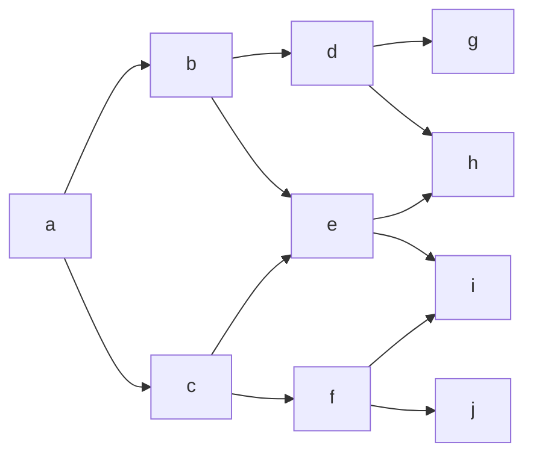

# DP-GWP1-Option-Pricing
## Table - American Option Using Trinomial
|	|Strike Price	|Call Option Price	|Put Option Price	|Parity|
|---|------------   |-----------------  |----------------   |------|
|0	|90.0	        |11.67	            |65.68	            |False |
|1	|95.0	        |7.72	            |70.68	            |False |
|2	|100.0	        |4.61            	|75.68	            |False |
|3	|105.0	        |2.48	            |80.68	            |False |
|4	|110.0	        |1.19	            |85.68	            |False |

